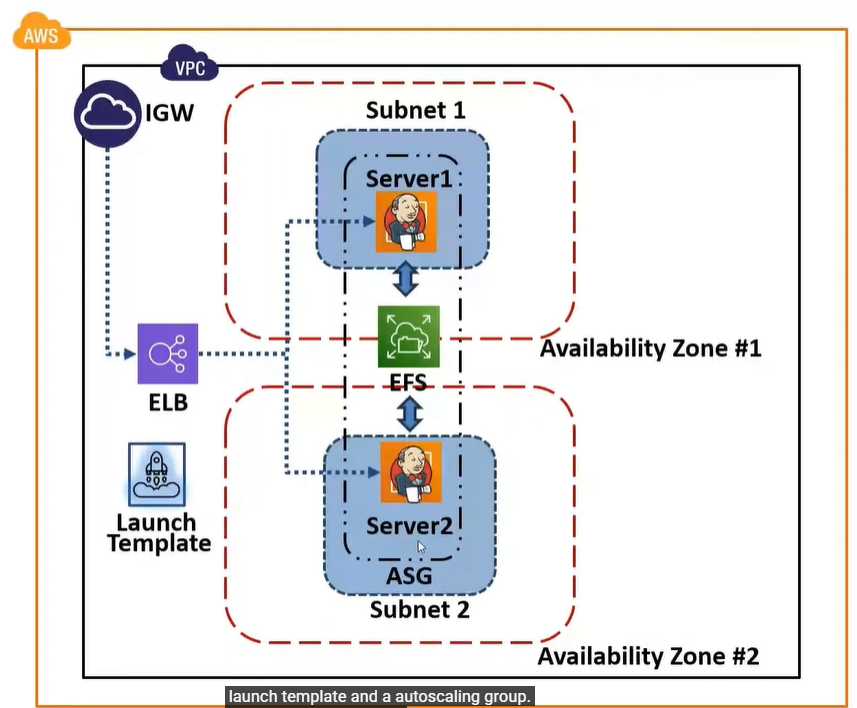
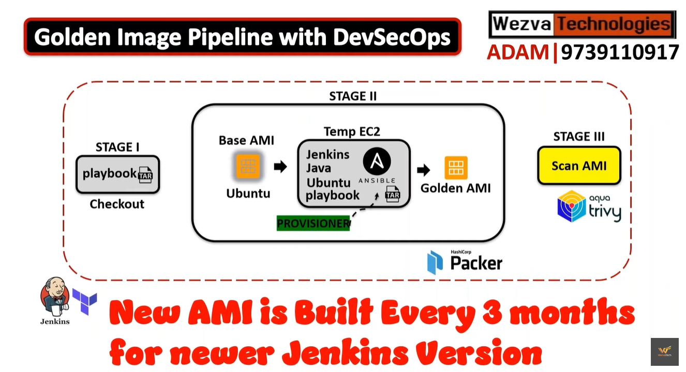

## DEVOPS/SRE Best Practices Widely Adopted by Tech Giants

- **6 Point**
  - Design Cloud native Solution
  - High Availability : How Quickly can you create another copy of that database. that the user does not impacted
  - Disaster Recovery :
  - Monitoring & Observability
  - Security-First-Approach (DevSecOps)
  - Automation

## DevOps/SRE Project Lifecycle

- _Design & Architect(Day 0)_ : Cloud Native, High availability, Automation. Disaster Recovery
- _Develop(Day 1)_ : Writing Code, Terraform Code, Ansible Code, K8s YAML Code.
- _Implement(Day 1)_ : After Writing the code the way you implement the code into your cloud native solution.
- _Operate(Day 2)_ : Monitoring, and Observability

---

## Achieving Release Readiness Using jenkins

- **Jenkins High Availability**
  - Load Balancer
  - FailOver
  - Replication

- **Jenkins HA Architecture**

- **Golden Image Pipeline With DevSecOps**
  Instead of taking the direct AWS or public image, you are going to create your own image as required in the organization by putting up whatever the right version of applications that we want secure and build your own image out of it.
- HashiCorp Packer
- 

---

Packer for Building AMI
Ansible For Configuring jenkins Master, OS updates
Trivy for scanning vulnerabilities
Terraform for Infra Creation - Network, Network, asg, template, efs, elb
Shell script
Jenkins Pipeline for automating the AMI builds

1. Create EFS
2. AMI Pipeline
   - Call Terraform
   - Terraform calls Packet with the EFS ID
   - Packet creates a temp Ec2, installs Ansible & runs ansible locally with the EFS ID
   - Packer creates a temp EC2, Installs Ansible & Runs ansible locally with the EFS ID
   - Packer will create a new AMI (Golden) & Delete the temp EC2
3. Create ELB
4. Create ASG Blue (Active-Active or Active Passive method)
5. Create ASG Green
6. Create s3 bucket - lifecycle after 30 days make the objects Infrequent Access, destroy after 90 days

---

**Responsibilities**

1. Design & Develop all the required IAC module using Terraform
2. Developed Packer code for Golden AMI generation
3. Developed all the required server configuration management module using Ansible
4. Developed shell script
5. Developed jenkins pipeline for Golden AMI generation, Regular backup
6. Upgrade Jenkins version once in 3 months (Blue/Green Strategy- for zero downtime)
7. Scaling Jenkins master based on requirement (Blue/Green Strategy- for zero downtime)
8. Build new Jenkins Golden AMI once in 1 month for security, hardening, OS Patch & Jenkins version.
9. Fix the vulnerabilities
10. Monitor
