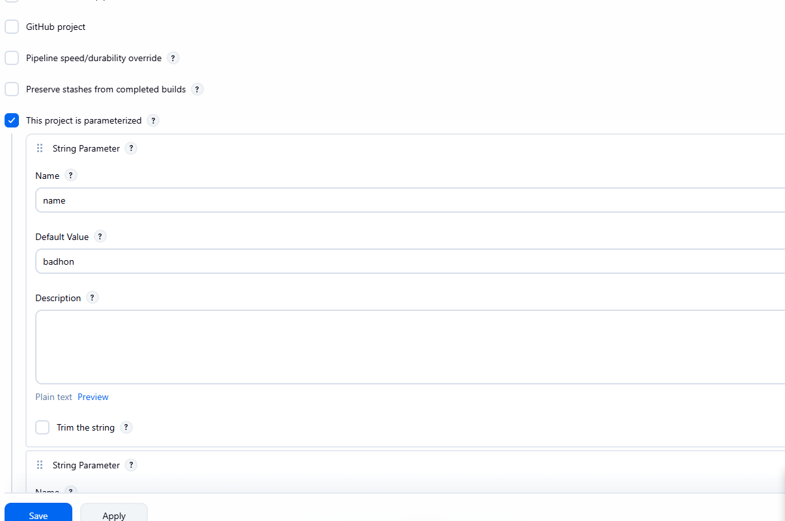

- **What is Continuous Integration (CI), What is Continuous Delivery (CD)?**
  - _CI_: CI is a software development practice where developers frequently merge their code changes into a central repo
  - _CD_ : Cd is a software development practice where software engineer build, tested and prepared for release to production by manual interaction.

- **Explain the Jenkins Master-Slave architecture.**
  - The Jenkins Master-Slave is design to offload build workload from a single central server onto multiple dedicated worker machines

- **How do you install Jenkins Docker and Linux**
  - _Docker_

```bash
version: '3.8'

services:
  jenkins:
    image: jenkins/jenkins:lts
    container_name: jenkins
    restart: unless-stopped
    ports:
      - "8080:8080"   # Jenkins Web UI

docker exec -it ecb67eb051d6 bash
```

- _Linux_

```bash

```

- **What is a Jenkinsfile? (Declarative vs Scripted).**
  - A jenkinsfile is a text file contains the source code of a jenkins pipeline and is checked into a source control repo.
  - _Declarative_ : Declarative config like structured, starts with pipeline {...}
  - _Scripted_ : Imperative (programmatic scripting), Starts with node {...}

- **Explain Stages, Stage, steps, posts in a pipeline.**
  - _Stages_ : Stages the master container for all logical phases
  - _Stage_ : Stage are the major logical divisions of your process like Build, Test, Deploy.
  - _Steps_ : Steps are the specific, individual tasks or commands executed within those stages. What the Build stage actually executes.

```bash
pipeline {
    agent any // Tells Jenkins to run this pipeline on any available machine

    // 1. STAGES: The master container for all logical phases
    stages {

        // Phase A: Build
        stage('Build') {
            // 2. STEPS: What the Build stage actually executes
            steps {
                echo 'Compiling the source code...' // Simple print step
                sh 'mvn clean compile'             // Shell command step to build code
            }
        }

        // Phase B: Test
        stage('Test') {
            steps {
                echo 'Running unit and integration tests...'
                sh 'mvn test'
            }
        }
    }
}

```

- _post_ : POST: Conditional tasks executed after all stages finished

```bash
pipeline {
    stages  {
        stage {
            steps   {
                echo "Compiling the Source Code"
            }
        }
    }
    post {
        always {
            // This block executes regardless of success or failure
            echo 'Cleaning up temporary workspace files...'
            deleteDir() // Deletes the working directory
        }
        success {
            // Executes ONLY if every stage completed successfully
            echo 'Pipeline completed successfully! Notifying the team...'
        }
        failure {
            // Executes ONLY if any step or stage failed
            echo 'Pipeline failed! Sending alert to developers...'
        }
    }
}
```

- **What are "Parameters" in Jenkins?**
  - Parameters in Jenkins are variables used to pass user-defined data into a build job before it starts. That allows you to run the same jenkins job multiple time
  - 

- **How do you manage secrets/credentials in Jenkins?**

```bash
pipeline {
    agent any

    stages {
        stage('Hello World') {
            steps {
                withCredentials([string(credentialsId: 'myName', variable: 'NameValue')]) {
                  sh  'echo $NameValue'
                }
            }
        }
    }
}

```

- **Explain ’Global Tool Configuration’.**
  - It is a system menu in the jenkins automation server used to defined and manage third party software and build tool.

- **How to integrate Jenkins with Docker?**
  - using user
    - sudo usermod -aG docker jenkins
  - User Docker file
    - using /var/run/docker.sock file
    - On docker creation we need to give me path mount to the jenkins

```bash
docker run -d --name jenkins \
    -p 8080:8080
    -v jenkins_home:/var/jenkins
    -v /var/run/docker.sock:/var/run/docker.sock
    jenkins/jenkins:lts
```

- **What is jenkins jobs**
  - Jenkins jobs refers to a project that automated unit of work

- **What is Downstream job**
  - A Downstream job is a tasks in cicd that is automatically triggered upon the successful completion of a preceding process.

- **What is Self-healing in a CI/CD pipeline?**
  - A Self-healing CiCd pipeline is an intelligent, automated system that detect, diagnoses, and resolved build or test failures without requirement of human intervention.

- **Explain 'Canary Release' through Jenkins**
  - Canary Release is a deployment strategy where a new software version is gradually rolling out to a small subset deployment before it making available to everyone
