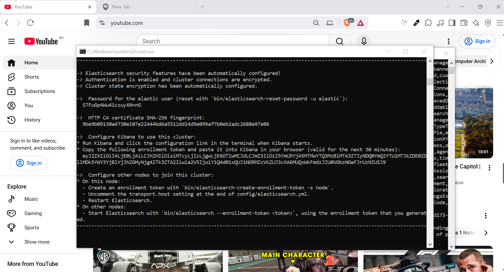

Elastic Stack: The Elastic Stack is a group of open source product build by Elastic

- _Elastic Search_ : Search Engin
- _Kibana_ : Analysis and Visualization
- _LogStack_ :
- _Beats_ :
- _X Pack_ :

## Elastic Search

- Open Source analytics and full text search engine
- It is built in Java
- Easy to use and highly scalable
- Often used to provide search functionality to an application with features like auto completing, correcting types, handling synonyms.

## Kibana

- Dashboard for analyzing & Visualization

## LogStash

- Process logs from applications and send them to elastic search. But over the time it has evolved
- Logstash is a free and open server-side data processing pipeline that ingests data from a multitude of sources, transforms it, and then sends it to stash. (Kafka/ Elastic Search)
- New line log file event -> LogStash -> Kafka/Elastic Search

## X Pack

Adds additional features to the ElasticSearch & Kibana

1. _Security_ - Adds Authentication and Authorization
2. Monitoring the performance of elastic stack and get notified
3. Enables machine learning on kibana and elastic search
4. Graph : Analyze relationship / relevance in data useful for recommendations. It exposes an api that we can integrate in our applications.
5. ElasticSearch SQL :
   - SQL API : SQL query - Result
   - Translate API : SQL query -> Query DSL (Domain Specific Language)

## Beats

Beats is a collection of data shippers. They are light weight agents which send data from hundreds or thousands of machines and systems (we will install these agents on these systems) to Logstash or Elasticsearch.

- Different Kinds of beats do different kind of tasks
  - _FileBeat_ : Lightweight shipper for logs and other data.
  - _Metricbeat_ : Lightweight shipper for metric data
  - _Packetbeat_ : Lightweight shipper for network data.
  - _Winlogbeat_ : Lightweight shipper for windows events logs
  - _Auditbeat_ : Lightweight shipper for audit data.
  - _Heatbeat_ : Lightweight shipper for uptime monitoring
  - _FunctionsBeat_ : Serverless shipper for cloud data

Centre is elastic search where all the data is present
We can put the data into elastic search via beats or logstash or event directly through elastic search APIs.
Kibana is UI that sits on elastic search and visualize elastic search's data

---

## DownLoad and Install Elastic Search and Kibana

- Download Elastic for Windows

```bash
$ https://www.elastic.co/downloads/elasticsearch

# Unzip it
# then run bin/elasticsearch.bat
```

## 

```bash
# Check on localhost
$ curl -X GET -k -u user:password  https://localhost:9200
```

---

## Sharding in Elasticsearch

- Sharding is a way to divide indices into smaller pieces.
- Each piece is called shard.
- Sharding is done at index level

- The Complete Explanation Of Replication In Elasticsearch
  - Replication
  - Primary Shard
  - Replica Shard
  - Replication group

## Elasticsearch Node Roles

- Master Node
  The master node is responsible for lightweight cluster-wide actions such as creating or deleting an index, tracking which nodes are part of the cluster, and deciding which shards to allocate to which nodes
- Data Role
  Data nodes hold the shards that contain the documents you have indexed
- Ingest
  