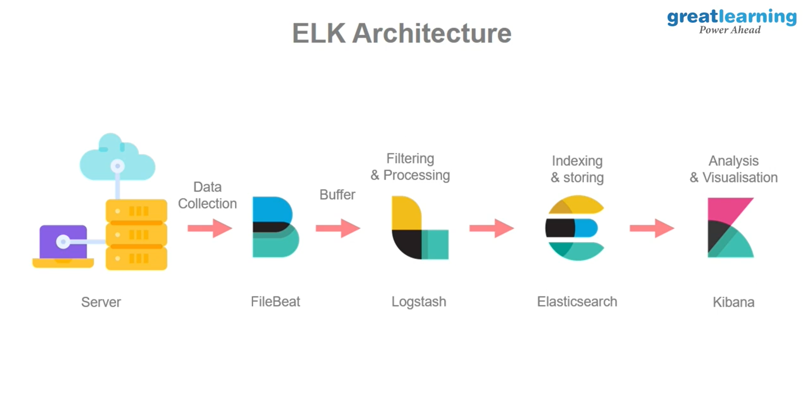

## Type of Monitoring:

- System Performance
- Process Monitoring
- Integration
- Application Performance
- Business Monitoring

## What is ELK Stack?

ELK stack is a set of open-source tools that allow us to monitor, collect, process analyze and visualize data, this data can be of different types and formats and from almost any source. It was developed by Elastic co. iteratively. They started with Elastic search and kept on adding more tools to the stack. The primary purpose of ELK stack is log management.

## ELK Features

- System & Application Performance
- Logging
- Stack Security and Alerting
- Scalability and Resiliency
- Dashboard and Visualizations

## ELK Stack

- _Logstash_ : Data Collection from the system
- _FileBeat_ : Collection Agents
- _Elastic Search_ :
- _Kibana_ : Visualization

## ELK Architecture



### ELK Implement

```bash
$ https://github.com/harishnshetty/ELK-Stack-TLS-SSL-Full-Setup-DevSecops-Project
```
